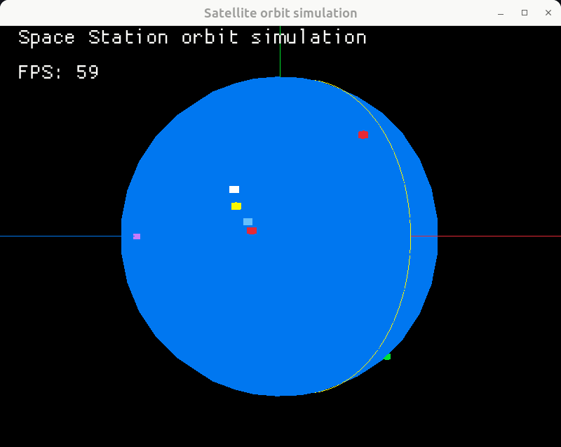

# space-station-orbit-simulation
The idea for this application is to integrate the information resulted from other repositories that provide TLE information for Space Station and to integrate to Macroquad UI enabling orbit trajectory visualization.

# Results
After getting the following TLE from N2YO api:

```json
{
    "info": {
        "satid": 25544,
        "satname": "SPACE STATION",
        "transactionscount": 0
    },
    "tle": "1 25544U 98067A   24346.21840358  .00019894  00000-0  34957-3 0  9992\r\n2 25544  51.6394 158.3036 0007055 326.7949 203.7258 15.50472908486009"
}
```

**Subtitle for the image below:** The earth is represented by the Blue Sphere, Colored cubes are European capitals(Ex. France, Luxembourg, Germany, Poland), I plotted some just as reference, the purple cube represents North Pole, the green cube represents Brazil(because why not =) ). Finally the red cube orbitating "earth" represents the International Space Station, the trajectory was propagated from TLE using sgp4. All coordinates here were translated to Earth-Centered Inertial(ECI) frame.

